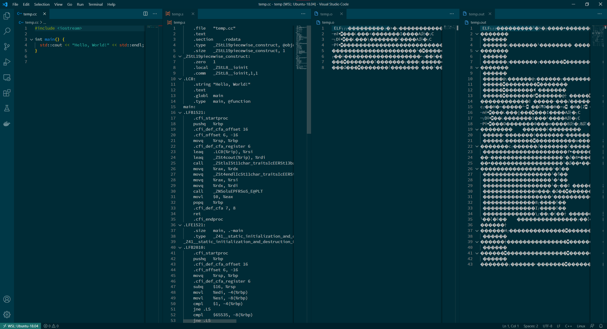

# Creative Software Programming Practice (week-5-1)

Every assignment will be announced on **Thursday** and should be sumitted by next **Tuesday**.

We have practice classes on Wednesdays and Thursdays. 
The contents of the practice class are different from the assignments and aim to be completed on the same day.

## Topics

1. Compilation and Linkage
2. Command-line Arguments
3. CMake

## 1. Compilation and Linkage

C++ programs are converted into executable files through the following process.

1. Source code file (`*.cc`, `*.c`, `*.cpp`)
2. Assembler file (`*.s`)
3. Object code file (`*.o`)
4. Executable file



When you write a c++ program, the next step is to compile the program before running it. The compilation is the process which convert the program written in human readable language like C, C++ etc into a machine code, directly understood by the Central Processing Unit. There are many stages involved in creating a executable file from the source file. The stages include Preprocessing, Compiling and Linking in C++. This means that even if the program gets compiled, it may result in not running as errors may arise during the linking phase.

These days compilers are run from IDE (Integrated Development Environment) such as CLion, Visual Studio that contains building and analysis tools. You just have to click the menu to compile the program and then execute it. But actually the whole process occurs in different phases. That is where compiling and linking in c++ comes.


```c++
// point.h
#ifndef __POINT_H__
#define __POINT_H__

typedef struct {
    double x;
    double y;
} Point;

#endif
```


```c++
// utility.h
#ifndef __UTILITY_H__
#define __UTILITY_H__

#include "point.h"
double distance(const Point& p1, const Point& p2);

#endif
```


```c++
// utility.cc
#include <cmath>
#include "utility.h"

double distance(const Point& p1, const Point& p2) {
    return sqrt(pow(p2.x - p1.x, 2) + pow(p2.y - p1.y, 2));
}
```


```c++
// main.cc
#include <iostream>
#include "point.h"
#include "utility.h"

// compiler just replace inline function (not call!)
inline void move(Point& pt, int x, int y) {
    pt.x += x;
    pt.y += y;
}

int main() {
    Point p1{0, 0};
    Point p2{3, 5};
    
    std::cout << "Distance: " << distance(p1, p2) << std::endl;
    
    move(p1, 0, 3);
    move(p2, -3, -2);
    
    std::cout << "Distance: " << distance(p1, p2) << std::endl;
    
    return 0;
}
```

## 2. Command-line arguments

C/C++ main function may takes additional input parameters.

The standard accepts two forms of main (*See the ISO C++ standard 3.6.1 or the ISO C standard 5.1.2.2.1, require int return*):
```
int main() {/* ... */}
int main(int argc, char* argv[]) {/* ... */}
```

**Not allow `void main() {}`**


```c++
// argument.cc
#include <iostream>

int main(int argc, char* argv[]) {
    for (int i = 0; i < argc; i++) {
        std::cout << "Argument(" << i << "): " << argv[i] << std::endl;
    }
    return 0;
}
```

```
$ ./argument this is argument 1 2 345
Argument(0): ./argument
Argument(1): this
Argument(2): is
Argument(3): argument
Argument(4): 1
Argument(5): 2
Argument(6): 345
```

## 3. CMake

Much easier to use with relatively simple syntax (generate Makefile)


```c++
//CMakeLists.txt
add_executable( main main.cc utility.cc )
```

After 1. Compilation and Linkage ...

```
$ cmake .
$ make
$ ./main
```


```c++

```
